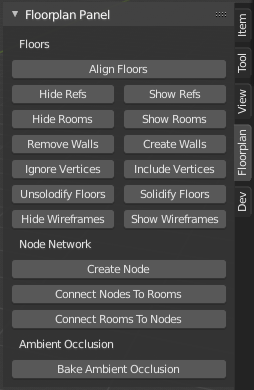

# Blender
Use [Blender 2.8](https://www.blender.org/) to open and edit the .blend files for the 3D floor plans.

## Using the Floorplan Addon
You can add the floorplan addon to Blender by going to Edit > Preferences > Add-ons > Install... and choosing the floorplan_addon.zip.
Next, enable the addon by searching for 'Import Floor Plan' in the search bar of the addon tab.

### 1. Converting PDF floorplans to json files
To run the script in this step you will need to have the [pdf2image](https://github.com/Belval/pdf2image) and [PyPDF2](https://pypi.org/project/PyPDF2/) modules installed. Please follow the installation instructions for the pdf2image module on its github page.

A usefull Blender addon to draw the wall lines in a floor plan is [Snap Utilities](https://gumroad.com/l/IaqQf).

The first step for getting a floorplans into Blender is to extract the necessary data from the PDF files. This is done by running the `convertPdfs.py` script. This script will walk through all sub directories, and tries to extract floorplan data from any pdf it encounters. For every pdf the script will create a json and png file in the same directory.

The json file will contain all the data for the floorplan in this pdf. Including the building name, floor number, scale, and every room.
For every room the room code, label, and x and y coordinates are extracted.

The png file is a transparent version of the floorplan that can later be used as a reference image in Blender.

### 2. Importing the floorplan into Blender

To import the floorplan data into Blender go to `File > Import > HR Floor Plan`, and select the json file that was generated in step 1.

### 3. Creating the 3D model

At this point you will have to do quite a bit of manual labor to create the 3D model for each floor, and draw a node network for the building. The floorpanel tools panel can help with this.

#### Floorplan Tools Panel Functions

- **Hide/Show Refs** - Show or hide the reference image of all floors in a building.

- **Hide/Show Rooms** - Hides or shows the green spheres representing room nodes.

- **Remove/Create Walls** - Creates or removes walls based on the model of the floor. Edges on the floor will be extruded upwards unless they are added to the 'ignore' vertex group. Doors will be created in spots where the node network intersects with a wall.

- **Ignore/Include Vertices** - Adds or removes selected vertices to the ignore vertex group.

- **Create Node** - Creates a node for the node network at the location of the cursor. Mostly usefull to create a new node network.

- **Connect Nodes To Rooms** - Moves room nodes (green sphere) that are close enough to a network node (red sphere) to to position of the network sphere.

- **Connect Rooms To Nodes** - Moves network nodes that are close enough to a room node to the position of the room node.

- **Mark/Unmark Entrance** - Marks or unmarks the selected room nodes as entry points to building's node network.

- **Bake Ambient Occlusion** - Starts baking ambient occlusion for every wall and floor model to image textures. This can take a while, do not make any changes to the scene while this is in progress.

#### Rough outline for creating the floorplan models.

1. Import the floorplan json file generated by convertPdfs.py.
2. When working with multiple floors, line up the reference image with the floor below it.
3. Draw the walls and stairs on the model of the floorplan using the addon [Snap Utilities](https://gumroad.com/l/IaqQf).
4. Draw a node network through over the walk ways of the floorplan.
5. Bake ambient occlusion for the building.
6. Set the name of the location by changing the name of the Blender scene in the top right.

### 4. Export the floorplan

After creating the complete 3D floorplan, it can be exported by going to `File > Export > HR Floor Plan`. This will create a json file, and a glb file.

The json file contains all the data of the node network: The nodes, and the connections between nodes. This json file can be used by the routing engine in the backend to calculate routes from one node to another.

The glb file is the 3D model of the floorplan that can be imported into Three.js. This file also includes the ambient occlusian maps.

## Floorplan Addon Development
The easiest way to write code for the floorplan addon is in [Visual Studio Code](https://code.visualstudio.com/) using the [Blender Development Extension](https://marketplace.visualstudio.com/items?itemName=JacquesLucke.blender-development). This extension allows you to easily reload Blender addons when changing code.
Additionaly you'll want to install the [bpy python module](https://pypi.org/project/bpy/) to resolve linting issues.
